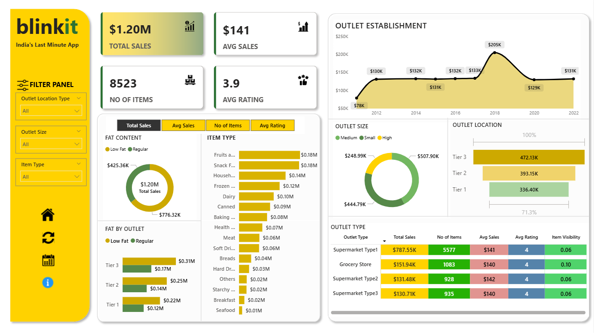

# Blinkit Sales Dashboard | Power BI Project

## Overview
This project is an interactive Blinkit Sales Dashboard created using Microsoft Power BI.

The dashboard provides insights into:
- Total Sales
- Average Sales
- Item Categories
- Outlet Performance
- Fat Content Analysis
- Outlet Size & Location Analysis
- Sales Trends

## Features
- Interactive Filter Panel
- KPI Cards
- Dynamic Charts
- Slicers for Filtering
- Professional UI Design
- Reset Filter Button
- Navigation Icons

## Tools & Technologies Used
- Microsoft Power BI
- DAX
- Data Visualization
- Data Cleaning

## Dashboard Preview



## Insights Generated
- Total sales performance by outlet type
- Best-selling product categories
- Outlet size contribution
- Location-wise sales comparison
- Fat content distribution analysis

## Project Structure

```text
blinkit-dashboard/
│
├── blinkit.pbix
├── dashboard-preview.png
└── README.md
```

## How to Use
1. Download the `.pbix` file
2. Open in Microsoft Power BI Desktop
3. Explore dashboard visuals and filters

## Author
Nancy Dua

## Connect With Me
LinkedIn: Add your LinkedIn profile link here
